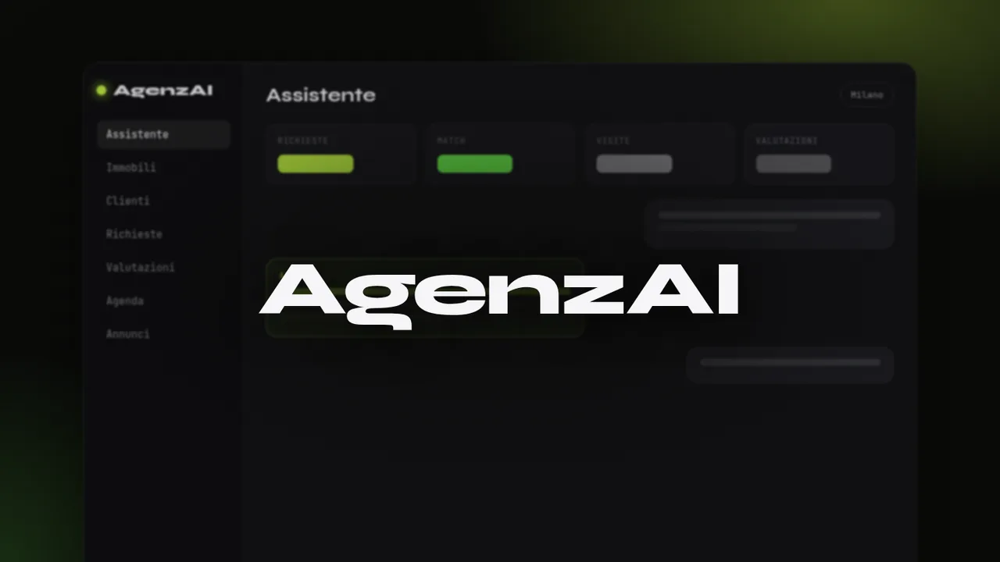

  

  
  
  

 

### AgenzAI

Il gestionale AI per le agenzie immobiliari italiane, a partire da Milano. Nasce da quello che abbiamo imparato costruendo e usando ogni giorno il CRM interno del gruppo: ora lo portiamo a tutte le agenzie, con l'intelligenza artificiale al centro. **In sviluppo.**

 

### AI e automazioni

Uso l'AI su due fronti: dentro i prodotti che costruiamo e per automatizzare il lavoro ripetitivo.

- **Modelli linguistici (LLM) nei prodotti**: testi, riepiloghi e suggerimenti generati dove servono, a partire dai dati reali.
- **Automazioni con AI**: dagli annunci immobiliari scritti in automatico ai flussi su email e WhatsApp, fino ai processi che girano da soli ogni giorno.
- **Agenti AI** che eseguono compiti in più passaggi: raccolgono dati, li elaborano e restituiscono un risultato pronto da usare.

Scriviamo noi il codice, dall'architettura al rilascio: l'AI è uno strumento che conosciamo a fondo, non un sostituto dello sviluppo.

 

### Stack

  

 

### Contributi

<picture>
  <source media="(prefers-color-scheme: dark)" srcset="https://raw.githubusercontent.com/samuelescavello/samuelescavello/output/snake.svg" />
  <source media="(prefers-color-scheme: light)" srcset="https://raw.githubusercontent.com/samuelescavello/samuelescavello/output/snake-light.svg" />
  
</picture>
