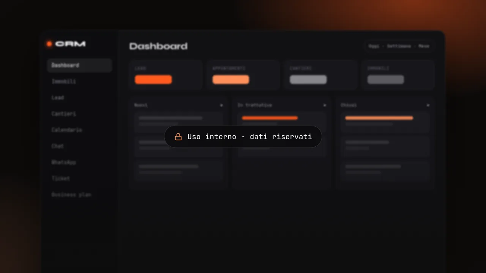
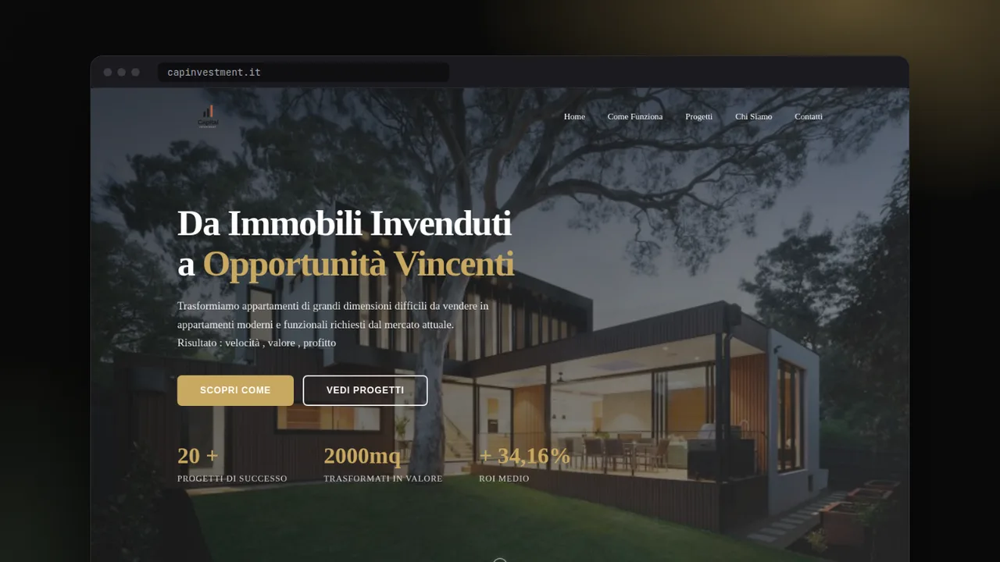
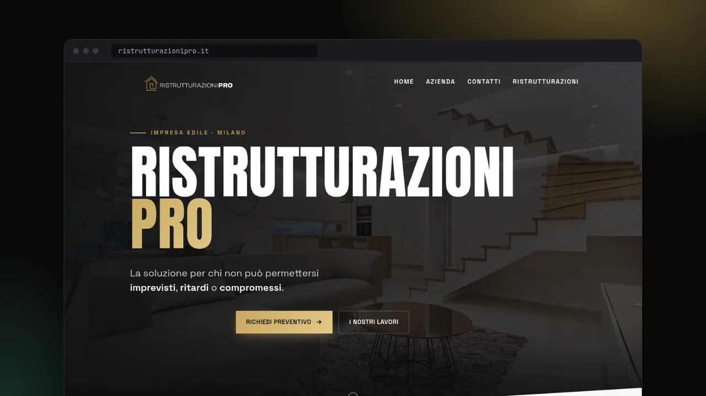
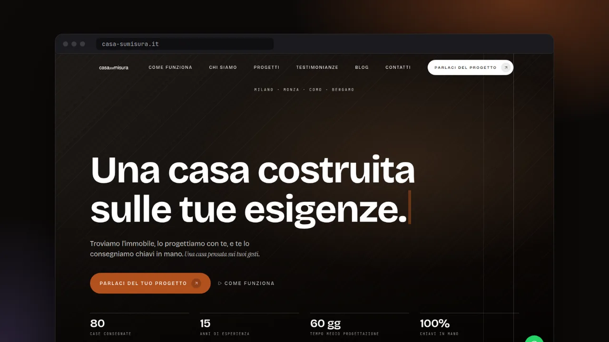

  

  
  
  

 

### Cosa stiamo costruendo

<table>
  <tr>
    <td width="50%" valign="top">
      
       <b>AgenzAI</b> · <i>in sviluppo</i> 
      Il gestionale AI per le agenzie immobiliari italiane, a partire da Milano. Nasce da quello che abbiamo imparato costruendo il CRM del gruppo.
    </td>
    <td width="50%" valign="top">
      
       <b>CRM del gruppo</b> · <i>uso interno</i> 
      Lead e immobili, cantieri, chat interna in tempo reale, WhatsApp integrato, ticket e business plan con valutazioni su 70 zone di Milano.
    </td>
  </tr>
</table>

<table>
  <tr>
    <td width="33%" valign="top">
      
       <a href="https://www.capinvestment.it"><b>Capital Investment</b></a> 
      Investimenti immobiliari a Milano
    </td>
    <td width="33%" valign="top">
      
       <a href="https://www.ristrutturazionipro.it"><b>Ristrutturazioni Pro</b></a> 
      Ristrutturazioni chiavi in mano, Milano e Monza
    </td>
    <td width="33%" valign="top">
      
       <a href="https://www.casa-sumisura.it"><b>CasaSuMisura</b></a> 
      Case trovate, progettate e consegnate chiavi in mano
    </td>
  </tr>
</table>

 

### Stack

  

 

### Dal campo alla produzione

  

Scriviamo noi il codice, dall'architettura al rilascio. L'AI è uno degli strumenti che usiamo, non un sostituto dello sviluppo. Il codice di produzione vive in repository privati: qui trovi chi sono e cosa facciamo, non il codice delle aziende.

 

### Contributi

<picture>
  <source media="(prefers-color-scheme: dark)" srcset="https://raw.githubusercontent.com/samuelescavello/samuelescavello/output/snake.svg" />
  <source media="(prefers-color-scheme: light)" srcset="https://raw.githubusercontent.com/samuelescavello/samuelescavello/output/snake-light.svg" />
  
</picture>
